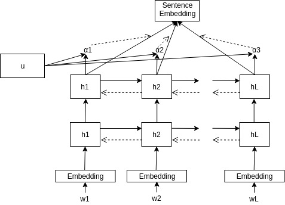

## EmoContext

### An attention based Deep&nbsp;
Bi-LSTM network for Emotion Detection

---

## Input Embeddings

* We used pre-trained GloVe model which was trained on 2 Billion tweets. We use this pretrained model to generate word embeddings
for our data set.

* We then feed the word embeddings to the sentence embedding model to get a sentence level representation for each turn of conversation.

---

## Self Attentive Sentence encoder

* We use self attention to compute the sentence embedding for each turn of conversation.

---
## Model

* We then concatenate the the three sentence embeddings (one for each
turn of conversation) and feed it to a fully connected neural network 
whose output dimension is equal to the number of output classes.
---

## Result

<table class="tg">
  <tr>
    <th class="tg-c3ow">Approach</th>
    <th class="tg-c3ow" colspan="3">Happy</th>
    <th class="tg-c3ow" colspan="2">Sad</th>
    <th class="tg-c3ow"></th>
    <th class="tg-c3ow" colspan="3">Angry</th>
  </tr>
  <tr>
    <td class="tg-c3ow"></td>
    <td class="tg-c3ow">Precision</td>
    <td class="tg-c3ow">Recall</td>
    <td class="tg-c3ow">F1</td>
    <td class="tg-c3ow">Precision</td>
    <td class="tg-c3ow">Recall</td>
    <td class="tg-c3ow">F1</td>
    <td class="tg-c3ow">Precision</td>
    <td class="tg-c3ow">Recall</td>
    <td class="tg-c3ow">F1</td>
  </tr>
  <tr>
    <td class="tg-uys7">SS-LSTM</td>
    <td class="tg-uys7">69.51</td>
    <td class="tg-uys7">52.29</td>
    <td class="tg-uys7">59.68</td>
    <td class="tg-c3ow">85.42</td>
    <td class="tg-c3ow">76.63</td>
    <td class="tg-c3ow">80.79</td>
    <td class="tg-c3ow">63.33</td>
    <td class="tg-c3ow">73.55</td>
    <td class="tg-c3ow">71.34</td>
  </tr>
  <tr>
    <td class="tg-uys7">2-BiLST+ attn</td>
    <td class="tg-uys7">65.05</td>
    <td class="tg-uys7">76.06</td>
    <td class="tg-uys7">70.13</td>
    <td class="tg-c3ow"> 71.52</td>
    <td class="tg-c3ow"> 76.80</td>
    <td class="tg-c3ow"> 72.18</td>
    <td class="tg-c3ow"> 60.56</td>
    <td class="tg-c3ow"> 76.06</td>
    <td class="tg-c3ow"> 71.07</td>
  </tr>
</table>
 ---

## Overall Performance

We compared our work with the SS-LSTM presented in the paper . Our network performed at par with SS-LSTM if not better, even though we used only one word embedding matrix i.e. the output from our self attentive neural BiLSTM network. 

The average F1-scores are as follows:

 * SS-LSTM: 71.34
 * Ours: 71.08 

